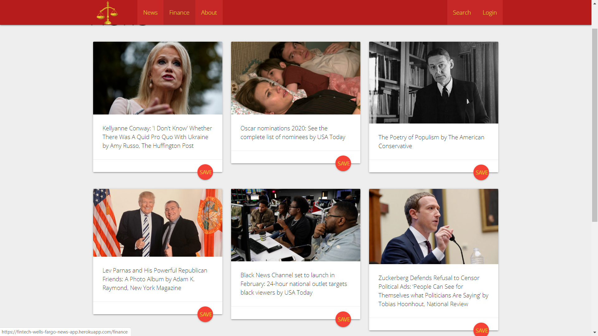
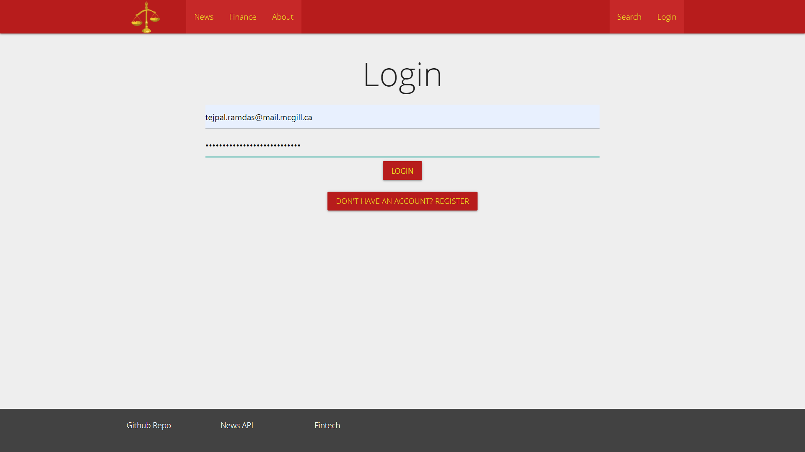
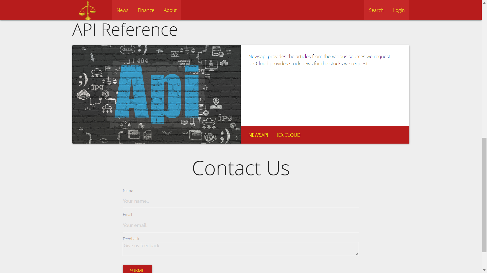

# NEWS

This full stack web application is designed to diplay news from various political leanings as well as displaying financial news about chosen stocks.  

The user can login or register and user data will be saved on the home page including saved articles and saved stocks.  

More information can be found on the about page as well as a contact form.

#Pictures

# To run locally:

See the requirements.txt for dependencies
Run the run variables in command line
Enter "flask run"

# Developed by Jose Jimenez, Tejpal Ramdas, and Richard Wong
# FinTech Focus at Wells Fargo 2019

